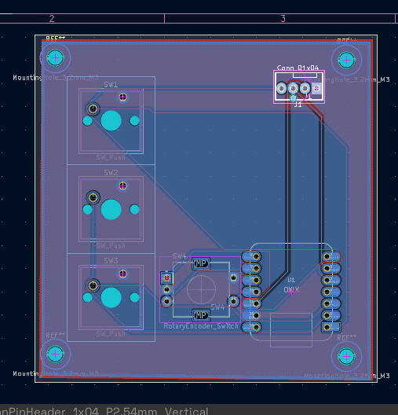
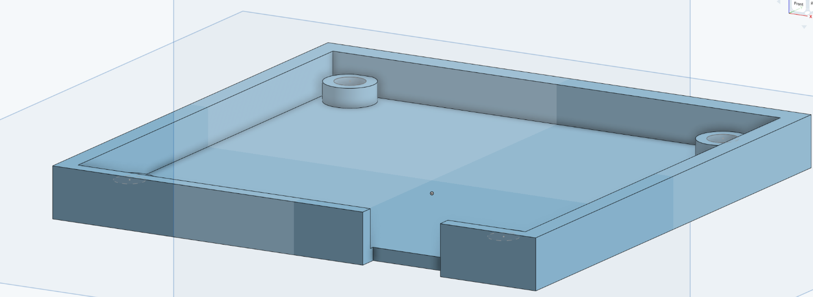
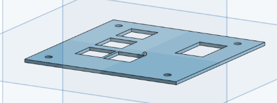

# ascii-emotion-controller

A macropad for switching the expressions of my ASCII character while
streaming or recording. Built for Hack Club Stardance.



## Why

I have a small face tracking app that renders an ASCII face and animates it
from my webcam and mic. The face sits on top of my stream in OBS, so the
browser window is never the focused one. Keystrokes always land somewhere
else, no matter what I press.

So the hackpad does not show up as a keyboard. It sends lines over USB
serial instead, and the page reads them with WebSerial. That works no matter
which window is in front.

## What is in it

* Seeed XIAO RP2040
* 3 Cherry MX switches
* 1 EC11 rotary encoder with push button
* 1 SSD1306 OLED, 0.91 inch, 128x32, over I2C
* 74 x 75 mm, two layers, solid ground pour
* Case is two printed parts, held together with M3 heatset inserts

Full part list in [BOM.csv](BOM.csv).

## Case




The base is a 8 mm tray with four 3 mm posts that hold the board off the
floor so the solder joints have room. The top plate is 1.5 mm thick around
the switch cutouts, which is what MX clips need to snap in.

## Controls

| Input | does |
| --- | --- |
| SW1 | normal `[+_+]` |
| SW2 | laughing `[*_*]` |
| SW3 | bored `[-_-]` |
| Turn wheel | opens the menu on the OLED |
| Press wheel in menu | confirm selection |
| Hold wheel | mouth keeps moving even when I am quiet |

The menu has auto, normal, laughing, bored, record and transparent.

## Protocol

The XIAO sends one line per event:

```
READY:hackpad
DOWN:btn1
UP:btn1
EXPR:laughing
ACT:record
```

## Repo layout

```
production/
  gerbers/      board files for the fab
  cad/          case as STEP and STL
  firmware/     boot.py and code.py
hardware/       KiCad project
web/            the face tracking page
docs/           renders and photos
BOM.csv
```

## Setup

### Firmware

Flash CircuitPython onto the XIAO, then copy `boot.py` and `code.py` from
`production/firmware/` to the root of the CIRCUITPY drive.

From the Adafruit library bundle into `CIRCUITPY/lib/`:

* `adafruit_displayio_ssd1306.mpy`
* `adafruit_display_text/`

`keypad`, `rotaryio` and `usb_cdc` are already built in.

### Website

Needs a local server, because ES modules fail CORS over `file://`:

```
cd web
python -m http.server 8000
```

Open `http://localhost:8000` and click the connect button in the bottom
right corner. The browser asks for permission once and remembers it.

Needs Chromium or Chrome. Firefox has no WebSerial.

On Linux your user needs access to `/dev/ttyACM0`. On Arch:

```
sudo usermod -aG uucp $USER
```

Log out and back in afterwards.

### Hardware

KiCad 9 or newer, project in `hardware/`.

The case prints without support. STEP files are in `production/cad/` if you
want to change something, STL next to them for printing straight away.

## Known things

* The OBS browser source cannot do WebSerial. The page runs in a Chromium
  window and OBS picks it up with a window capture.
* Chromium freezes tabs that are fully hidden, so the window has to stay
  visible somewhere. I keep it on its own workspace.
* The display footprint is drawn for a 1.3 inch module but a 0.91 inch one
  goes in. The four pads line up, the printed outline is just a bit large.

## License

MIT
